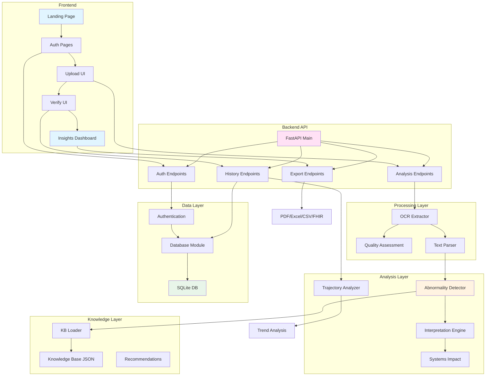
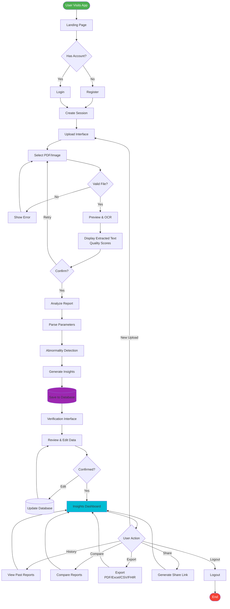

# Smart Lab Report Analyser - Project Documentation

## Abstract

The Smart Lab Report Analyser is an AI-powered web application that automates the analysis of laboratory blood test reports. The system uses OCR technology to extract text from uploaded PDF and image files, intelligently parses 100+ lab parameters, and provides personalized health insights based on demographic-specific reference ranges. Key features include multi-user authentication, historical tracking, trajectory analysis, cross-parameter correlation detection, severity classification, and multi-format report export (PDF, Excel, CSV, HL7 FHIR). The application bridges the gap between complex medical data and patient understanding through plain-language interpretations, interactive visualizations, and actionable recommendations while maintaining appropriate medical disclaimers.

---

## Introduction

Laboratory blood tests are essential diagnostic tools, but their interpretation remains challenging for patients due to technical terminology, varying reference ranges, and complex parameter interactions. Traditional lab reports present data in formats that are difficult for non-medical professionals to understand, often requiring physician consultation for interpretation.

The Smart Lab Report Analyser addresses these challenges by providing an intelligent, automated system that extracts test parameters from diverse document formats, applies demographic-aware analysis using personalized reference ranges, and delivers actionable insights through plain-language interpretations. The application enables historical tracking with trend visualization, ensures data portability through standard medical formats, and maintains medical safety through confidence scoring and appropriate disclaimers.

Built with Python FastAPI backend and modern responsive frontend, the system leverages Tesseract OCR for text extraction, SQLite for data persistence, and session-based authentication for security. It supports multiple export formats including HL7 FHIR for EMR integration, making it a comprehensive solution for personal health data management.

---

## Objectives

### Primary Objectives

1. **Automated Lab Report Analysis**
   - Extract text from PDF and image-based reports with high accuracy
   - Parse and identify 100+ common blood test parameters
   - Handle multi-page documents with automatic deduplication
   - Assess document quality with improvement suggestions

2. **Personalized Medical Interpretation**
   - Implement demographic-specific reference ranges (age, gender, ethnicity)
   - Provide contextual cross-parameter analysis
   - Generate plain-language insights for abnormal parameters
   - Calculate severity classifications (Low, Medium, High, Critical)

3. **Historical Data Management**
   - Store and retrieve user-specific lab report history
   - Enable parameter-level trend tracking
   - Support comparison between current and previous reports
   - Implement trajectory analysis with risk projection

4. **User Experience Excellence**
   - Design intuitive, modern web interface
   - Implement multi-stage upload flow with preview and validation
   - Provide interactive data verification with inline editing
   - Create comprehensive insights dashboard with visualizations

5. **Data Security & Privacy**
   - Implement secure user authentication
   - Ensure user data isolation
   - Maintain audit trails for critical operations
   - Support secure report sharing with expiring links

### Secondary Objectives

- Export reports in HL7 FHIR format for healthcare integration
- Suggest missing tests based on current parameters
- Provide follow-up and lifestyle recommendations
- Implement systems impact analysis for physiological systems

---

## Scope

### In Scope

**Document Processing:**
- PDF files (single and multi-page)
- Image files (JPEG, PNG) with rotation support
- OCR-based text extraction with quality assessment

**Parameter Detection:**
- Complete Blood Count (CBC)
- Metabolic Panel (glucose, electrolytes, kidney function)
- Liver Function Tests
- Lipid Profile
- Thyroid Function
- Vitamins & Minerals
- Cardiac Markers
- 100+ total parameters

**User Management:**
- Registration and secure login
- Profile management with demographics
- Session management

**Analysis Features:**
- Automated abnormality detection
- Demographic-aware reference ranges
- Cross-parameter correlation analysis
- Severity assessment
- Systems impact scoring
- Trajectory analysis

**Reporting & Export:**
- Interactive insights dashboard
- PDF, Excel, CSV, HL7 FHIR export
- Shareable links with QR codes
- Historical comparisons

### Out of Scope

- Clinical diagnosis or treatment recommendations
- Direct laboratory information system (LIS) integration
- Prescription or medication management
- Telemedicine or video consultation
- Insurance claims processing
- Native mobile apps (web-responsive only)
- Multi-language support
- Medical imaging (X-rays, MRIs, CT scans)
- Genomic data analysis
- Hospital/clinic administrative features

---

## Literature Review

**Patient Engagement through Lab Access**  
Research shows that providing patients with direct access to laboratory results improves health literacy and treatment adherence (Delbanco et al., 2012). However, medical terminology complexity remains a significant barrier.

**Reference Range Variability**  
Studies demonstrate substantial variation in reference ranges across demographics. Age-specific and gender-specific ranges are critical for accurate interpretation, particularly for hemoglobin, creatinine, and thyroid hormones (Adeli et al., 2015).

**OCR in Healthcare**  
OCR technology has been successfully applied to medical document digitization with accuracy rates of 85-98% depending on document quality and standardization (Holmström et al., 2019).

**HL7 FHIR for Interoperability**  
The FHIR standard has emerged as the preferred framework for healthcare data exchange, offering RESTful APIs and resource-based models ideal for modern applications (Mandel et al., 2016).

**Automated Abnormality Detection**  
Rule-based systems combined with statistical thresholds demonstrate effectiveness in flagging abnormal laboratory values with sensitivity and specificity exceeding 90% (Shortliffe & Cimino, 2014).

**Health Information Design**  
Effective health interfaces require plain-language explanations, visual representations, and contextual help. Color-coded severity indicators and trend visualizations significantly improve user comprehension (Kayser et al., 2015).

**Data Privacy Requirements**  
HIPAA and GDPR mandate strict controls on personal health information storage and transmission. Secure authentication, encryption, and audit logging are essential (Abouelmehdi et al., 2018).

---

## Architectural Diagram

**Architecture Overview:**
- **Frontend Layer**: Progressive web pages (Landing → Auth → Upload → Verify → Insights)
- **Backend API**: FastAPI REST endpoints for all operations
- **Processing Layer**: OCR extraction, quality assessment, intelligent parsing
- **Analysis Layer**: Abnormality detection, interpretation, advanced analytics
- **Data Layer**: SQLite database with authentication and audit trails
- **Knowledge Layer**: Medical knowledge base and recommendation engines

---

## Flow Diagram

**Flow Description:**
1. **Authentication**: User registers or logs in → session created
2. **Upload & Preview**: File selection → validation → OCR preview → quality check
3. **Analysis**: Parsing → abnormality detection → interpretation → database save
4. **Verification**: User reviews and confirms extracted data
5. **Insights**: Dashboard with history, comparisons, exports, and sharing options

---

## List of Modules

### Frontend Modules

1. **Landing Page** (`index.html`, `landing.css`, `landing.js`) - Entry point with navigation
2. **Authentication** (`login.html`, `register.html`, `auth.js`) - User registration and login
3. **Upload Interface** (`upload_ui.html/css/js`) - File upload with drag-drop and preview
4. **Verification UI** (`verify_ui.html/css/js`) - Data validation and inline editing
5. **Insights Dashboard** (`insights_ui.html/css/js`) - Analysis results with visualizations
6. **Documentation** (`documentation_ui.html`) - User guides and help
7. **Design System** (`clinical_design_system.css`, `modern_theme.css`) - Unified styling

### Backend Modules

8. **Main Application** (`main.py`) - FastAPI app with all endpoints
9. **OCR Extractor** (`extractor.py`) - Text extraction from PDFs and images
10. **Quality Assessment** (`quality_assessment.py`) - Document quality evaluation
11. **Text Parser** (`parser.py`) - 100+ parameter regex patterns
12. **Enhanced Parser** (`parser_enhanced.py`) - Intelligent identifier
13. **Abnormality Detector** (`abnormality_detector.py`) - Core analysis engine with demographic ranges
14. **Interpretation Engine** (`interpretation.py`) - Plain-language insights
15. **Systems Impact** (`systems_impact.py`) - 8 physiological system analysis
16. **Trajectory Analyzer** (`trajectory_analyzer.py`) - Time-series trend analysis
17. **Pattern Detector** (`pattern_detector.py`) - Statistical pattern recognition
18. **Clinical Intelligence** (`clinical_intelligence.py`) - Advanced contextual reasoning
19. **Knowledge Base Loader** (`knowledge_base_loader.py`) - Medical knowledge management
20. **Missing Tests Suggester** (`missing_tests_suggester.py`) - Test recommendations
21. **Follow-up Recommendations** (`followup_recommendations.py`) - Actionable next steps
22. **Lifestyle Recommendations** (`lifestyle_recommendations.py`) - Personalized health advice
23. **Database Module** (`database.py`) - SQLite data persistence
24. **Authentication** (`auth.py`) - Secure user authentication with bcrypt
25. **Audit Trail** (`audit_trail.py`) - Activity logging
26. **Report Generator** (`report_generator.py`) - PDF creation with ReportLab
27. **Export Handlers** (`export_handlers.py`) - Excel, CSV, HL7 FHIR export
28. **Historical Context** (`historical_context.py`) - Comparison analysis

### Supporting Files

29. **Knowledge Base** (`knowledge_base.json`) - Medical reference data (~48KB)
30. **Database** (`reports.db`) - SQLite database
31. **Environment Config** (`.env`) - Configuration variables
32. **Requirements** (`requirements.txt`) - Python dependencies

---

## References

1. Adeli, K., et al. (2015). "Biochemical Marker Reference Values." *Clinical Chemistry*, 61(8), 1049-1062.

2. Delbanco, T., et al. (2012). "Inviting Patients to Read Their Doctors' Notes." *Annals of Internal Medicine*, 157(7), 461-470.

3. Holmström, A. R., et al. (2019). "Impact of Electronic Health Records on Service Quality." *BMC Medical Informatics and Decision Making*, 19, Article 179.

4. Mandel, J. C., et al. (2016). "SMART on FHIR: A Standards-Based Apps Platform." *Journal of the American Medical Informatics Association*, 23(5), 899-908.

5. Shortliffe, E. H., & Cimino, J. J. (2014). *Biomedical Informatics: Computer Applications in Health Care*. Springer-Verlag.

6. Kayser, L., et al. (2015). "eHealth Literacy Questionnaire Development." *Journal of Medical Internet Research*, 17(2), e36.

7. Abouelmehdi, K., et al. (2018). "Big Healthcare Data: Preserving Security and Privacy." *Procedia Computer Science*, 113, 73-80.

8. American Diabetes Association (2021). "Standards of Medical Care in Diabetes." *Diabetes Care*, 44(Supplement 1).

9. FastAPI Documentation (2023). Retrieved from https://fastapi.tiangolo.com/

10. HL7 FHIR R4 Specification (2021). Retrieved from http://hl7.org/fhir/R4/
